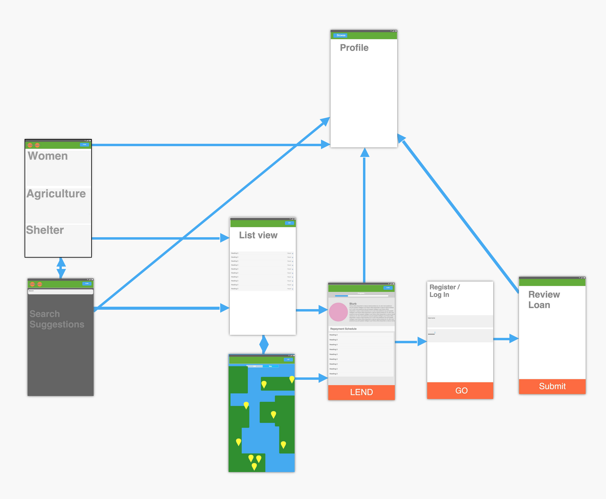

# Kiva

#### _"Loans that change lives"_

Kiva is a non-profit that alleviates poverty around the world through loans. This Android application provides a way to log in, browse borrowers, make loans, and track repayment progress.

##### User Stories
Required
1. Discover borrowers (pre-populated search)
2. Search borrowers, show results in list and map
3. Detail view
4. Register / log in
5. Profile screen
6. Make a loan
7. Track repayment progress
Optional Stories
1. Button on borrower detail page to add to 'Favorite' borrowers
2. View list of 'Favorites' to compare different projects
3. Show a real-time feed of transactions taking place
4. Filter the feed to only show certain 'Teams' or Geographic areas

##### Wireframe

> [kiva.org](https://www.kiva.org)
